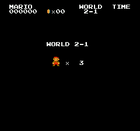

# Super Mario Bros. fMRI Dataset - Complete Tutorial

A comprehensive tutorial for analyzing naturalistic fMRI data from the CNeuromod Mario dataset, combining session-level GLM analysis, brain map visualization, RL agent training, and brain encoding models.

<div align="center">


&nbsp;&nbsp;&nbsp;&nbsp;


<br><br>


---

</div>


## Overview

The CNeuromod Mario subdataset is part of the Courtois Neuromod databank. More information can be found [here](https://docs.cneuromod.ca/en/latest/DATASETS.html#mario). The dataset itself is openly available via datalad, and can be explored on [GitHub](https://github.com/courtois-neuromod/mario).




---

### Notebooks

The tutorial is organized into four main notebooks that can be run locally or directly in Google Colab:

| Notebook | Colab Link | Description | Duration |
|----------|------------|-------------|----------|
| [`00_dataset_overview.ipynb`](notebooks/00_dataset_overview.ipynb) | [](https://colab.research.google.com/github/courtois-neuromod/mario.tutorials/blob/main/notebooks/00_dataset_overview.ipynb) | Dataset exploration and behavioral annotations | 15 min |
| [`01_event_based_analysis.ipynb`](notebooks/01_event_based_analysis.ipynb) | [](https://colab.research.google.com/github/courtois-neuromod/mario.tutorials/blob/main/notebooks/01_event_based_analysis.ipynb) | GLM analysis for actions and game events | 20 min |
| [`02_reinforcement_learning.ipynb`](notebooks/02_reinforcement_learning.ipynb) | [](https://colab.research.google.com/github/courtois-neuromod/mario.tutorials/blob/main/notebooks/02_reinforcement_learning.ipynb) | RL agent training and CNN activation extraction | 25 min |
| [`03_brain_encoding.ipynb`](notebooks/03_brain_encoding.ipynb) | [](https://colab.research.google.com/github/courtois-neuromod/mario.tutorials/blob/main/notebooks/03_brain_encoding.ipynb) | Ridge regression encoding models and layer comparison | 20 min |


### Analysis Pipeline Overview

```
┌─────────────────────────────────────────────────────────────────┐
│                         fMRI Data                               │
│                    (BOLD time series)                           │
└────────────┬──────────────────────────────────────────┬─────────┘
             │                                          │
    ┌────────▼─────────┐         ┌──────────────────┐   │
    │   GLM Analysis   │         │   RL Agent       │   │
    └────────┬─────────┘         └────────┬─────────┘   │
             │                            │             │
    ┌────────▼─────────┐         ┌────────▼──────────┐  │
    │ Hypothesis-driven│         │ Learned features  │  │
    │ contrasts        │         │ (CNN activations) │  │
    │ - LEFT vs RIGHT  │         └────────┬──────────┘  │
    └────────┬─────────┘                  │             │
             │                   ┌────────▼─────────────▼┐
             │                   │   Ridge Encoding      │
             │                   │   (Predict BOLD)      │
             │                   └────────┬──────────────┘
             │                            │
    ┌────────▼────────────────────────────▼──────────┐
    │         Brain Activity Maps                    │
    │    Which regions? What representations?        │
    └────────────────────────────────────────────────┘
```

**GLM:** Hand-crafted regressors → Interpretable contrasts

**Encoding:** Learned representations → Predictive power


### Glossary

- **Repetition**: An attempt (3 lives) on a given level. Corresponds to one *.bk2 file.
- **Run**: A series of several repetitions (usually around 8-10). Minimum duration of 10 mins.
- **Session**: A single recording session, totalling between 3 and 5 runs.
- **Level**: Levels are grouped by world. Their name is written a w1l1 (world-1 level-1) or Level1-1 (in the SuperMarioBros-Nes gym-retro implementation)
- **Scene**: A segment of a level, defined from set boundaries on the horizontal axis. Their name are written as w1l1s1 (world-1 level-1 scene-1). Scenes and clips are generated via mario.scenes.
- **Clip**: A single attempt over a scene. Identified with a clip-code constituted of 14 digits as follows : AAABBCCDDDDDDD with AAA representing the session, BB the run, CC the index of the repetition within the run, and DDDDDDD the index of the first frame corresponding to that clip, within the repetition.

## Tutorials

This tutorial demonstrates a complete fMRI analysis pipeline from data exploration to brain encoding, following methodologies inspired from:
- [**shinobi_fmri**](https://github.com/courtois-neuromod/shinobi_fmri): Session-level GLM modeling and visualization ([**reference**](https://osf.io/preprints/psyarxiv/uakq9_v3))
- [**mario_generalization**](https://github.com/courtois-neuromod/mario_generalization): RL agent training and brain encoding ([**reference**](https://2025.ccneuro.org/abstract_pdf/Harel_2025_Brittle_Brain_Encoding_Poor_Out-of-Distribution_Generalization.pdf))

**Scope**: Single subject (sub-01), single session (ses-010) - optimized for laptop execution


## Installation

This tutorial is designed to run seamlessly both **locally** and on **Google Colab**. The notebooks themselves handle the environment setup and data installation automatically, ensuring you have the correct dependencies and datasets for each environment.

### 1. Initial Setup (Local Only)

If running locally, ensure you have `git` installed and clone this repository:

```bash
git clone https://github.com/courtois-neuromod/mario.tutorials
cd mario.tutorials
```

For Colab users, the environment setup (including cloning) is handled automatically by the first cell in each notebook.

### 2. Running the Tutorials

Once you have the repository, launch Jupyter Notebook or open directly in Google Colab:

#### Local Execution

```bash
# (Optional: Create and activate a Python virtual environment if you don't use conda)
# python3 -m venv env
# source env/bin/activate

# Install core dependencies (datalad will be installed by the notebooks)
pip install -r requirements.txt

# Launch Jupyter
jupyter notebook
```

Then, navigate to the `notebooks/` directory and open any notebook. The initial cells will guide you through installing DataLad, fetching necessary data, and setting up the Python environment.

#### Google Colab Execution

Simply open any notebook (`.ipynb` file) directly in Google Colab from the GitHub repository. The first code cell in each notebook will detect the Colab environment and automatically:
- Install system dependencies (e.g., `git-annex`).
- Install Python packages (e.g., `datalad`).
- Clone the repository (if accessed directly).
- Download relevant datasets using DataLad (`mario`, `mario.fmriprep`, `cneuromod.processed`).

### 3. Data Availability

The datasets required for this tutorial (approximately 7-8 GB for the featured single session) are managed and downloaded automatically by the notebooks using **DataLad**. The first notebook, `00_dataset_overview.ipynb`, provides a detailed overview of this process. Subsequent notebooks will silently ensure data is available before proceeding.

## Tutorial Structure

### What You'll Learn

- **Notebook 0**: Understand the CNeuromod Mario dataset structure, explore behavioral annotations, and visualize event timelines
- **Notebook 1**: Build GLM models, fit session-level analyses, compute contrasts (hand lateralization), and apply FWE correction
- **Notebook 2**: Train a PPO agent, extract CNN layer activations, apply PCA for dimensionality reduction, and visualize learned representations
- **Notebook 3**: Fit ridge regression encoding models, compare layer performance, and visualize brain prediction maps

### Source Code Modules

Analysis modules are organized in the `src/` directory:

- `src/utils.py` - General utilities (data loading, BIDS helpers, path management)
- `src/glm_utils.py` - GLM analysis functions (confounds, design matrices, fitting, contrasts)
- `src/rl_utils.py` - RL agent utilities (CNN architecture, activations, HRF, PCA)
- `src/encoding_utils.py` - Brain encoding models (ridge regression, evaluation, visualization)

See `src/README.md` for detailed documentation of each module.

## Analysis Pipeline

```
📊 Dataset Overview
    ↓
    Explore BIDS structure
    Load behavioral annotations
    Visualize event timelines

🧠 Event-Based Analysis (GLM)
    ↓
    Build design matrices
    Fit multi-run GLM models
    Compute statistical contrasts
    Apply FWE correction

🤖 Reinforcement Learning
    ↓
    Train PPO agent
    Extract CNN activations
    Apply PCA reduction
    Visualize representations

📈 Brain Encoding
    ↓
    Fit ridge regression models
    Compare layer performance
    Generate prediction maps
```

## Key Features

### GLM Analysis
- **Confound strategy**: 24 motion params + WM/CSF + global signal
- **Models**:
  - Simple actions (one at a time)
  - Intermediate movement (LEFT vs RIGHT)
  - Full actions (all buttons)
  - Game events (reward/punishment)
- **Session-level aggregation**: Fixed-effects across runs
- **HRF**: SPM canonical, AR(1) noise model

### Brain Encoding
- **RL Agent**: 4-layer CNN (PPO architecture)
- **Training options**:
  - Quick: Imitation learning (~5 min)
  - Recommended: Pre-trained weights (~1 min)
  - Advanced: Full PPO training (~2 hours)
- **Encoding**: Ridge regression with cross-validated α
- **Layer analysis**: Compare conv1-4 and linear layers
- **PCA reduction**: 50 components per layer for efficiency

### Visualization
- Surface projections (fsaverage)
- Glass brain views
- Statistical thresholding (FDR, cluster correction)
- R² brain maps for encoding models

## Dependencies

See `requirements.txt` for full list. Key packages:
- **Neuroimaging**: nilearn, nibabel
- **ML**: scikit-learn, torch
- **RL**: gym, stable-retro
- **Jupyter**: jupyter, notebook
- **Viz**: matplotlib, seaborn

## Dataset Information

**CNeuromod Mario Dataset**
- Task: Play Super Mario Bros (NES) naturally
- Subjects: 5 (sub-01, sub-02, sub-03, sub-05, sub-06)
- Sessions: 21-29 per subject
- Runs: 3 to 5 per session, ~10 minutes each
- TR: 1.49 seconds
- Levels: 22 levels across 8 worlds:
  - World 1: w1l1, w1l2, w1l3
  - World 2: w2l1, w2l3
  - World 3: w3l1, w3l2, w3l3
  - World 4: w4l1, w4l2, w4l3
  - World 5: w5l1, w5l2, w5l3
  - World 6: w6l1, w6l2, w6l3
  - World 7: w7l1, w7l3
  - World 8: w8l1, w8l2, w8l3

  *Selection rationale: All non-underwater, non-Bowser levels for gameplay consistency*

**Experimental Regimen**:
- **Discovery Phase**: Players explored levels sequentially to learn game mechanics and level layouts
- **Practice Phase**: Levels presented in random order to test generalization and skill transfer

**Annotations**:
- Actions: A (JUMP), B (RUN/FIREBALL), LEFT, RIGHT, UP, DOWN
- Events: Kills, hits, powerups, coins, level completions
- Scenes: Level segmentation
- Replays: .bk2 files with frame-by-frame state and JSON metadata

## Resources

- **CNeuromod**: https://www.cneuromod.ca
- **CNeuromod Documentation**: https://docs.cneuromod.ca/
- **Nilearn Documentation**: https://nilearn.github.io
- **DataLad Handbook**: https://handbook.datalad.org/

## Optional: Generate Architecture Diagram

To create the beautiful 3D CNN architecture visualization for notebook 02:

```bash
# Install LaTeX and ImageMagick (one-time)
sudo apt-get install texlive-latex-extra imagemagick

# Generate and compile the diagram
python generate_architecture_diagram.py
pdflatex ppo_architecture.tex
convert -density 300 ppo_architecture.pdf -quality 90 -background white -alpha remove notebooks/figures/ppo_architecture.png
```

## Troubleshooting

### Common Issues

**Issue**: DataLad installation fails
- **Solution**: Try using pip instead: `pip install datalad`

**Issue**: Notebooks can't find source modules
- **Solution**: Ensure you're running Jupyter from the `notebooks/` directory and that `src/` is in the parent directory

**Issue**: BOLD data not found
- **Solution**: Run `bash install_mario_datasets.sh` to download the required datasets

**Issue**: Out of memory errors
- **Solution**: The tutorial is designed for laptops with 8GB+ RAM. If issues persist, reduce the number of voxels by using a more restrictive mask.

---

**GL&HF!** 🧠🎮
